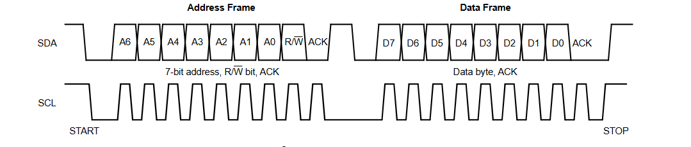

<h1 align="center">Verilog Implementation of I2C Protocol</h1>


<p align="center">
  <strong>Project by:</strong><br>
  <strong>Jagadeesh Mummana</strong> (B231113EC)<br>
  <strong>Yasaswi Akkineni</strong> (B231347EC)<br>
</p>

<p align="center">
  Dr. <strong>Ashutosh Mishra</strong><br> 
  Professor, ECED<br>
  National Institute of Technology Calicut, Kerala, India
</p>


<p align="center">
  Department of Electronics and Communication Engineering<br>
  Semester: III<br>
  Course: Elective - EC2024E Hardware Modelling using HDL
</p>


# Table of Contents

- [Overview](#overview)
  - [Project Abstract](#project-abstract)
  - [Background and Motivation](#background-and-motivation)

- [Project Proposal](#project-proposal)
  - [Project Description](#project-description)

- [Intro to Inter-Integrated Circuit Protocol](#intro-to-inter-integrated-circuit-protocol)
  - [Comparison with Other Communication Protocols](#comparison-with-other-communication-protocols)

- [Industrial Applications of I²C Protocol](#industrial-applications-of-i2c-protocol)
  - [Sensor Integration and Monitoring](#sensor-integration-and-monitoring)
  - [Industrial Control Systems](#industrial-control-systems)
  - [Data Acquisition Systems](#data-acquisition-systems)
  - [Industrial Communication and Diagnostics](#industrial-communication-and-diagnostics)
  - [Battery-Operated and Low-Power Industrial Devices](#battery-operated-and-low-power-industrial-devices)

- [Physical Layer](#physical-layer)
  - [Two-Wire Communication](#two-wire-communication)
  - [Open-Drain Connection](#open-drain-connection)
  - [I2C Protocol](#i2c-protocol)

- [Module Specifications](#module-specifications)

- [MASTER MODULE](#master-module)
  - [Code](#c0d3)
  - [Explanation](#explanation)
    - [Module Declaration](#module-declaration)
    - [State Machine Definition](#state-machine-definition)
    - [Clock Divider](#clock-divider)
    - [SDA and SCL Control](#sda-and-scl-control)
    - [Finite State Machine (FSM)](#finite-state-machine-fsm)
    - [SDA Output Logic](#sda-output-logic)

- [SLAVE MODULE](#slave-module)
  - [Code](#c0d3-1)
  - [Explanation](#explanation-1)
    - [Module Declaration](#module-declaration-1)
    - [State Machine Definition](#state-machine-definition-1)
    - [Internal Registers and Signals](#internal-registers-and-signals)
    - [SDA Line Control](#sda-line-control)
    - [Start and Stop Condition Detection](#start-and-stop-condition-detection)
    - [FSM Logic for Data Transfer](#fsm-logic-for-data-transfer)
    - [SDA Output Logic](#sda-output-logic-1)
  - [Summary](#summary)

- [TOP-LEVEL MODULE](#top-level-module)
  - [Code](#c0d3-2)
  - [Explanation](#explanation-2)

- [TESTBENCH MODULE](#testbench-module)
  - [Code](#c0d3-3)
  - [Explanation](#explanation-3)
  - [Results](#results)

- [Challenges and Risk Analysis](#challenges-and-risk-analysis)
  - [Potential Issues and Solutions](#potential-issues-and-solutions)
  - [Risk Management](#risk-management)

- [Future Work and Improvements](#future-work-and-improvements)
  - [Suggested Enhancements](#suggested-enhancements)
  - [Alternative Designs](#alternative-designs)

- [Appendices](#appendices)
  - [Verilog Code Listings](#verilog-code-listings)
  - [References](#references)


# Overview

## Project Abstract

This project focuses on the **Verilog implementation of the I2C
(Inter-Integrated Circuit) protocol**, a widely used serial
communication standard that allows multiple devices to communicate over
just two wires. I2C is designed to be both **simple and efficient**,
making it ideal for embedded systems that connect low-speed peripherals
such as sensors, EEPROMs, and microcontrollers. The goal of this project
is to develop a Verilog model that accurately simulates the I2C
protocol, enabling multiple devices to exchange data on a shared
communication line while showcasing the flexibility and effectiveness of
Verilog in hardware design.

## Background and Motivation

Communication protocols are vital in embedded systems, facilitating
reliable and efficient data exchange between devices. Among various
protocols, **I2C stands out for its simplicity and capacity to support
multiple devices using only two wires**. In contrast to protocols like
SPI, which require more connections for multi-device configurations,
I2C's minimal wiring makes it particularly suitable for
**space-constrained applications and cost-effective designs**. This
flexibility makes I2C a preferred choice in systems where effective
communication between components is essential.

# Project Proposal

## Project Description

This project focuses on the **Verilog implementation of the I2C
(Inter-Integrated Circuit) protocol**, a popular communication method
used in embedded systems. Communication protocols are essential because
they define the rules and conventions for data exchange between devices.
I2C stands out by combining the best features of other protocols like
**SPI (Serial Peripheral Interface)** and **UART (Universal Asynchronous
Receiver-Transmitter)**. With I2C, multiple slave devices can be
connected to a single master device, allowing for efficient data
sharing. Moreover, it supports multiple masters, enabling several
controllers to communicate with one or more slaves. This capability is
particularly beneficial in applications where multiple microcontrollers
need to log data to a single memory card or display information on a
single LCD. Our project aims to create a Verilog model that accurately
simulates the I2C protocol, demonstrating how these devices can
communicate effectively and showcasing Verilog's utility in hardware
design.

## Intro to Inter-Integrated Circuit Protocol

### Industrial Applications of I2C Protocol

The Inter-Integrated Circuit (I2C) protocol is a widely used serial
communication standard in industrial environments, valued for its
simplicity, cost-effectiveness, and minimal wiring requirements. It is
ideal for short-distance communication and low-power applications,
making it well-suited for industrial settings. Key industrial
applications ofI2C are outlined below.

#### Sensor Integration and Monitoring

I2C is commonly used to connect various sensors to a central processor
or microcontroller, enabling real-time data acquisition essential for
industrial automation and control.

-   **Temperature, Humidity, and Pressure Sensors**: These sensors
    monitor environmental conditions in factories, data centers, and
    storage facilities.I2C enables multiple sensors to communicate
    with a central controller, which processes data to maintain optimal
    conditions.

-   **Vibration and Motion Sensors**: Used for predictive maintenance,
    these sensors monitor machinery health.I2C communication with a
    central processor allows for data analysis, enabling detection of
    wear or impending failures to reduce unplanned downtime.

-   **Gas and Chemical Sensors**: In chemical plants, gas sensors detect
    harmful gases and leaks.I2C facilitates communication with a
    monitoring system, ensuring quick detection and response to
    hazardous conditions.

#### Industrial Control Systems 

I2C is used extensively in industrial control systems to enable
efficient communication between modules and controllers.

-   **Programmable Logic Controllers (PLCs)**:I2C interfaces with
    peripheral modules like ADCs and DACs in PLC systems, converting
    analog sensor signals into digital data for automation and control.

-   **Motor Controllers**: In robotics, conveyor belts, and automated
    machinery,I2C is used for communication between motor controllers
    and the CPU, allowing precise control of speed, position, and
    torque.

-   **Human-Machine Interfaces (HMIs)**:I2C connects small displays
    to control units in industrial equipment, allowing real-time system
    visualization and updates for operators.

#### Data Acquisition Systems 

Data acquisition, crucial in industrial quality control and process
monitoring, benefits from I2C's ability to connect multiple sensors or
data modules to a single controller with minimal wiring.

-   **Analog-to-Digital and Digital-to-Analog Converters**: I2C
    interfaces ADCs and DACs with a central processor to process analog
    data from sensors for real-time decision-making.

-   **Data Logging and Memory Modules**: Data loggers and memory modules
    connected overI2C allow periodic data storage, crucial for
    monitoring environments in factories or energy usage in power
    plants.

#### Industrial Communication and Diagnostics 

I2C supports diagnostic applications in industrial systems, allowing
engineers to monitor and troubleshoot components.

-   **Diagnostic Modules**: Diagnostic modules usingI2C enable
    real-time tracking of equipment health and quick detection of issues
    through communication with a central processor.

-   **Firmware Updates and Calibration**:I2C enables in-field updates
    and recalibration by interfacing with memory chips that store
    configuration and calibration data for industrial devices.

#### Battery-Operated and Low-Power Industrial Devices

In remote or battery-operated equipment, where low power is essential,
I2C's efficiency makes it ideal.

-   **Portable Measurement Instruments**: Handheld tools, such as
    digital multimeters, useI2C to connect internal components (e.g.,
    displays, sensors) while minimizing power consumption.

-   **Battery Management Systems (BMS)**: In applications like electric
    vehicles, BMSs useI2C to monitor battery health, charge, and
    discharge cycles, ensuring efficient energy management.

**Conclusion**: I2C's capability to connect multiple devices on a
single bus with minimal wiring, along with its low power requirements,
makes it an ideal protocol for various industrial applications. From
sensor integration to control systems and data acquisition,I2C offers
a reliable and cost-effective solution for modern industrial automation
and monitoring. To understand the advantages of communicating over I2C,
it's essential to compare it with other available options, particularly
**UART** and **SPI**.

### Comparison with Other Communication Protocols

**Limitations of Serial UART Ports:** Serial UART ports are
asynchronous, meaning they do not transmit clock data alongside the
information. As a result, the devices must agree in advance on a data
rate, and their clocks need to maintain close synchronization. Any
significant discrepancy in clock rates can lead to garbled data.
Moreover, asynchronous serial ports require substantial hardware
overhead; the UART implementation at each end is relatively complex and
challenging to accurately realize in software. Each frame of data
includes at least one start bit and one stop bit, resulting in 10 bits
of transmission time for every 8 bits of data, which adversely affects
the effective data rate.

Furthermore, UART ports are primarily designed for communication between
two devices. Although multiple devices can be connected to a single
serial port, this leads to **bus contention**, where multiple devices
attempt to drive the same line simultaneously. This contention must be
managed to prevent potential damage to the devices, typically requiring
additional external hardware. Lastly, while there is no theoretical
limit to the data rates of asynchronous serial communications, most UART
devices support a limited set of fixed baud rates, typically capping
around 230,400 bits per second.

<figure id="fig:uart_block_diagram">
<span class="image placeholder"
data-original-image-src="tex-supp-files/uart_block_diagram.png"
data-original-image-title="" width="80%"></span>
<figcaption>Block Diagram of an Asynchronous Serial System</figcaption>
</figure>

<p align="center">
  <br>
  
  <br>
</p>


**Drawbacks of SPI:** The most significant limitation of the Serial
Peripheral Interface (**SPI**) is the number of pins it requires.
Connecting a single controller to one peripheral necessitates four
lines; adding each additional peripheral demands an extra chip select
I/O pin on the controller. This proliferation of pin connections becomes
cumbersome in situations where numerous devices need to connect to a
single controller, complicating the routing of signals in constrained
PCB layouts.

Additionally, SPI supports only one controller on the bus but can
accommodate multiple peripheral devices, limited only by the drive
capabilities of the connected devices and the availability of chip
select pins. While SPI enables high data rate full-duplex communication
(simultaneous sending and receiving of data) with clock rates exceeding
10 MHz, the implementation typically involves simple shift registers,
facilitating easier software integration.

<figure id="fig:spi_block_diagram">
<span class="image placeholder"
data-original-image-src="spi_block_diagram.png"
data-original-image-title="" width="80%"></span>
<figcaption>Block Diagram of an SPI System</figcaption>
</figure>

<p align="center">
  <br>
  
  <br>
</p>


**The Advantages of I2C:** I2C combines the strengths of both UART and
SPI. It operates using just two wires, like asynchronous serial, yet
supports communication with up to 1,008 peripheral devices. Unlike SPI,
I2C accommodates multi-controller systems, allowing more than one
controller to communicate with all peripheral devices on the bus
(although the controllers must take turns using the bus lines).

I2C data rates fall between those of asynchronous serial and SPI, with
most devices communicating at 100 kHz or 400 kHz. While there is some
overhead---requiring one additional acknowledgment (ACK/NACK) bit for
every 8 bits of data transmitted---I2C remains efficient. Although
implementing I2C requires more complex hardware than SPI, it is still
simpler than asynchronous serial and can be easily realized in software.

<figure id="fig:i2c_block_diagram">
<span class="image placeholder"
data-original-image-src="i2c_block_diagram.png"
data-original-image-title="" width="80%"></span>
<figcaption>Block Diagram of an I2C System</figcaption>
</figure>

<p align="center">
  <br>
  
  <br>
</p>


## Physical layer

### Two-Wire Communication

An I2C system utilizes **two shared communication lines** for all
devices on the bus. These two lines facilitate **bidirectional,
half-duplex communication**. I2C supports multiple controllers and
multiple target devices, making it a flexible choice for various
applications. It is essential to use **pull-up resistors** on both of
these lines to ensure proper operation. Fig
[2.4](#fig:i2c_implementation){reference-type="ref"
reference="fig:i2c_implementation"} shows a typical implementation of
the I2C physical layer.

<figure id="fig:i2c_implementation">
<span class="image placeholder"
data-original-image-src="i2c_physical_layer.png"
data-original-image-title="" width="80%"></span>
<figcaption>Typical I2C Implementation</figcaption>
</figure>

<p align="center">
  <br>
  
  <br>
</p>


One of the main reasons that I2C is a widely adopted protocol is due to
its requirement of only **two lines** for communication. The first line,
**SCL**, is the serial clock line, primarily controlled by the
controller device. SCL is responsible for synchronously clocking data in
or out of the target device. The second line, **SDA**, is the serial
data line, used to transmit data to or from the target devices. For
instance, a controller device can send configuration data and output
codes to a target **digital-to-analog converter (DAC)**, or a target
**analog-to-digital converter (ADC)** can send conversion data back to
the controller device.

I2C operates as a **half-duplex communication** protocol, meaning that
only one controller or target device can send data on the bus at any
given time. In contrast, the **Serial Peripheral Interface (SPI)** is a
**full-duplex protocol** that allows data to be sent and received
simultaneously, requiring four lines for communication: two data lines
for sending and receiving data, along with a serial clock and a unique
SPI chip select line to select the device for communication.

An I2C controller device initiates and terminates communication, which
eliminates potential issues related to **bus contention**. Communication
with a target device is established through a **unique address** on the
bus, allowing multiple controllers and multiple target devices to
coexist on the I2C bus.

The SDA and SCL lines have an **open-drain connection** to all devices
on the bus, necessitating a pull-up resistor connected to a common
voltage supply.

### Open-Drain Connection

The **open-drain connections** are employed on both the SDA and SCL
lines and are linked to an NMOS transistor. This open-drain
configuration manages the I2C communication line by either pulling the
line low or allowing it to rise to a high state. The term \"open-drain\"
refers to the NMOS bus connection when the NMOS is turned **OFF**.
Figure [2.5](#fig:open_drain_connection){reference-type="ref"
reference="fig:open_drain_connection"} illustrates the open-drain
connection when the NMOS is turned **ON**.

<figure id="fig:open_drain_connection">
<span class="image placeholder"
data-original-image-src="open_drain_connection.png"
data-original-image-title="" width="80%"></span>
<figcaption>Open-Drain Connection Pulls Line Low When NMOS is Turned
On</figcaption>
</figure>

<p align="center">
  <br>
  
  <br>
</p>


To establish the voltage level of the SDA or SCL line, the NMOS
transistor is either switched **ON** or **OFF**. When the NMOS is
**ON**, it allows current to flow through the resistor to ground,
effectively pulling the open-drain line low. This transition from high
to low is typically rapid, as the NMOS quickly discharges any
capacitance on the SDA or SCL lines.

When the NMOS turns **OFF**, the device ceases to pull current, and the
pull-up resistor subsequently raises the SDA or SCL line back to
**VDD**. Figure [2.6](#fig:open_drain_off){reference-type="ref"
reference="fig:open_drain_off"} shows the open-drain line when the NMOS
is turned **OFF**, illustrating how the pull-up resistor brings the line
high.

<figure id="fig:open_drain_off">
<span class="image placeholder"
data-original-image-src="open_drain_off.png"
data-original-image-title="" width="80%"></span>
<figcaption>Open-Drain Line with NMOS Turned Off</figcaption>
</figure>

<p align="center">
  <br>
  
  <br>
</p>


The transition of the open-drain line to a high state is slower because
the line is pulled up against the bus capacitance, rather than being
actively driven high.

## I2C Protocol

Communication over **I2C** requires a specific signaling protocol to
ensure that devices on the bus recognize valid I2C transmissions. While
this process is more intricate than **UART** or **SPI**, most
I2C-compatible devices handle the finer protocol details internally,
allowing developers to focus primarily on data exchange.

**SDA and SCL Lines:** The I2C bus operates with two main lines: **SDA**
(Serial Data Line) and **SCL** (Serial Clock Line). Data is transmitted
over the **SDA** line in sync with clock pulses on the **SCL** line.
Generally, data is placed on **SDA** when **SCL** is low, and devices
sample this data when **SCL** goes high. If needed, multiple internal
**registers** may control data handling, especially in complex devices.

**Protocol Components:**

1\. **Start Condition:** To initiate communication, the controller sets
**SCL** high and then pulls **SDA** low. This signals all peripheral
devices on the bus that a transmission is starting. In cases where
multiple controllers attempt to start communication simultaneously, the
first device to pull **SDA** low gains control. If necessary, the
controller can issue repeated start conditions to maintain bus control
without releasing it.

2\. **Address Frame:** Every I2C transmission begins with an **address
frame** to specify the target peripheral. This frame consists of a 7-bit
address, sent **MSB** (most significant bit) first, followed by a **R/W
bit** indicating the operation type (read or write).

After this, the 9th bit, known as the **ACK/NACK bit**, is used by the
receiving device to confirm reception. If the device pulls **SDA** low
before the 9th clock pulse (**ACK**), communication continues. If not
(**NACK**), it indicates either unrecognized data or an issue in
reception, prompting the controller to decide the next steps.

3\. **Data Frames:** Following the address frame, one or more **data
frames** are sent over the **SDA** line. Each data frame is 8 bits, and
data is transferred from the controller to the peripheral or vice versa,
based on the **R/W bit** in the address frame.

Many peripheral devices have auto-incrementing **internal registers**,
enabling data to continue from consecutive registers without the need to
re-specify the register address.

4\. **Stop Condition:** The controller ends communication by generating
a **stop condition**. This is done by transitioning **SDA** from low to
high after a high-to-low transition on **SCL**, with **SCL** held high
during the stop sequence. To avoid false stop conditions, the value on
**SDA** should not change while **SCL** is high during regular data
transmission.

The **I2C protocol** divides communication into structured **frames**.
Each communication sequence begins with a **START** condition, initiated
by the controller, followed by an **address frame** and then one or more
**data frames**. Every frame also includes an acknowledgment (ACK) bit,
signaling that the frame has been received successfully by the intended
device. **Figure 3-3** illustrates the structure of two I2C
communication frames, showing both address and data frames in detail.

<figure id="fig:i2c_frames">
<span class="image placeholder" data-original-image-src="i2c_frames.png"
data-original-image-title="" width="80%"></span>
<figcaption>I2C Address and Data Frames</figcaption>
</figure>


<p align="center">
  <br>
  
  <br>
</p>


In an I2C transaction, the controller first sends a **START condition**
by pulling the **SDA** line low, followed by the **SCL** line. This
sequence asserts control over the bus, preventing other devices from
interfering. Each target device on the I2C bus has a unique **7-bit
address**, allowing the controller to specify which target device it
intends to communicate with.

Once the address is set on **SDA** while **SCL** acts as the clock, the
**8th bit** (R/W bit) indicates the intended operation type: **read
(1)** or **write (0)**. This initial address and R/W bit are followed by
an **ACK bit**, sent by the target device to confirm receipt. If the
target device receives the address successfully, it pulls **SDA** low
during the next **SCL** pulse, signaling an ACK. If no device
acknowledges, the line remains high, signaling a **NACK**.

After the address frame, one or more **data frames** follow. Each data
frame contains 8 bits of data, which are acknowledged (ACK) in the 9th
bit. If the data frame is a **write** operation, the target device pulls
**SDA** low to confirm data receipt. For **read** operations, the
controller pulls **SDA** low to acknowledge receipt of the data. The
presence or absence of the ACK is essential for troubleshooting, as a
missing ACK may indicate an addressing error or transmission failure.

Finally, the communication ends with a **STOP condition**, where the
controller releases **SCL** first, followed by **SDA**. This action
releases the I2C bus for other devices to use, completing the
communication cycle.

This structured protocol allows for the transmission of multiple bytes
within one communication sequence. In cases where a target device has
multiple internal **registers**, a write operation can specify the
register to read or write data to, enhancing flexibility and enabling
complex data transactions.

# Module Specifications

## MASTER MODULE

### C0d3

```verilog
`timescale 1ns / 1ps

// Main module declaration
module i2c_master(
    input wire clk,                // System clock
    input wire rst,                // Reset signal
    input wire [6:0] addr,         // 7-bit I2C slave address
    input wire [7:0] data_in,      // Data to send to slave in write mode
    input wire enable,             // Start signal for I2C communication
    input wire rw,                 // Read/Write control (0 for write, 1 for read)
    output reg [7:0] data_out,     // Data received from slave in read mode
    output wire ready,             // Indicates when the master is ready for a new transaction
    inout i2c_sda,                 // I2C data line (SDA) - bidirectional
    inout wire i2c_scl             // I2C clock line (SCL) - bidirectional
);

    // Define states for I2C master FSM
    localparam IDLE = 0;
    localparam START = 1;
    localparam ADDRESS = 2;
    localparam READ_ACK = 3;
    localparam WRITE_DATA = 4;
    localparam WRITE_ACK = 5;
    localparam READ_DATA = 6;
    localparam READ_ACK2 = 7;
    localparam STOP = 8;

    localparam DIVIDE_BY = 4;      // Clock divider to generate I2C clock from system clock

    reg [7:0] state;               // Current state of the FSM
    reg [7:0] saved_addr;          // Stores the 7-bit address and RW bit for the current transaction
    reg [7:0] saved_data;          // Data to be sent in write transactions
    reg [7:0] counter;             // Bit counter for data/address transmission
    reg [7:0] counter2 = 0;        // Divider counter for generating i2c_clk
    reg write_enable;              // Controls whether the master drives SDA line
    reg sda_out;                   // Data to output on SDA line when write_enable is 1
    reg i2c_scl_enable = 0;        // Controls the state of the i2c_scl line (enabled or high)
    reg i2c_clk = 1;               // Internal I2C clock signal

    // Ready signal is high when the master is idle and not in reset
    assign ready = ((rst == 0) && (state == IDLE)) ? 1 : 0;

    // I2C SCL signal: High when i2c_scl_enable is low; otherwise, driven by i2c_clk
    assign i2c_scl = (i2c_scl_enable == 0) ? 1 : i2c_clk;

    // SDA line is driven by sda_out when write_enable is high; otherwise, it's in high-impedance
    assign i2c_sda = (write_enable == 1) ? sda_out : 'bz;

    // I2C clock divider: Divides system clock to generate i2c_clk
    always @(posedge clk) begin
        if (counter2 == (DIVIDE_BY / 2) - 1) begin
            i2c_clk <= ~i2c_clk;    // Toggle i2c_clk when half period is reached
            counter2 <= 0;          // Reset the divider counter
        end else begin
            counter2 <= counter2 + 1; // Increment the divider counter
        end
    end

    // Enable/disable I2C clock based on current state
    always @(negedge i2c_clk or posedge rst) begin
        if (rst == 1) begin
            i2c_scl_enable <= 0;    // Disable SCL on reset
        end else begin
            if ((state == IDLE) || (state == START) || (state == STOP)) begin
                i2c_scl_enable <= 0; // SCL is disabled in IDLE, START, and STOP states
            end else begin
                i2c_scl_enable <= 1; // Enable SCL in other states
            end
        end
    end

    // State machine for controlling the I2C master operation
    always @(posedge i2c_clk or posedge rst) begin
        if (rst == 1) begin
            state <= IDLE;          // Reset state to IDLE on reset
        end else begin
            case (state)
                
                IDLE: begin
                    if (enable) begin
                        state <= START;  // Start I2C transaction when enable is high
                        saved_addr <= {addr, rw};  // Save the 7-bit address and RW bit
                        saved_data <= data_in;     // Save the data to be sent (in write mode)
                    end
                end

                START: begin
                    counter <= 7;          // Initialize bit counter to 7 for 8-bit transmission
                    state <= ADDRESS;      // Move to ADDRESS state
                end

                ADDRESS: begin
                    if (counter == 0) begin 
                        state <= READ_ACK;  // Move to ACK check after sending address and RW bit
                    end else begin
                        counter <= counter - 1;  // Transmit address bits, count down
                    end
                end

                READ_ACK: begin
                    if (i2c_sda == 0) begin  // ACK received (SDA pulled low by slave)
                        counter <= 7;       // Reset bit counter
                        if (saved_addr[0] == 0) state <= WRITE_DATA; // If RW=0, go to write mode
                        else state <= READ_DATA;                     // If RW=1, go to read mode
                    end else begin
                        state <= STOP;      // NACK received, move to STOP state
                    end
                end

                WRITE_DATA: begin
                    if (counter == 0) begin
                        state <= READ_ACK2; // Move to second ACK check after data transmission
                    end else begin
                        counter <= counter - 1; // Transmit data bits, count down
                    end
                end

                READ_ACK2: begin
                    if ((i2c_sda == 0) && (enable == 1)) state <= IDLE; // Return to IDLE on ACK
                    else state <= STOP;  // If NACK received or enable low, go to STOP
                end

                READ_DATA: begin
                    data_out[counter] <= i2c_sda;  // Capture data bit from SDA line
                    if (counter == 0) state <= WRITE_ACK; // After last bit, go to WRITE_ACK
                    else counter <= counter - 1; // Count down for each bit received
                end

                WRITE_ACK: begin
                    state <= STOP;  // Go to STOP after sending ACK
                end

                STOP: begin
                    state <= IDLE;  // Go back to IDLE after STOP condition
                end
            endcase
        end
    end

    // SDA output logic based on the current state
    always @(negedge i2c_clk or posedge rst) begin
        if (rst == 1) begin
            write_enable <= 1;       // Drive SDA high on reset
            sda_out <= 1;
        end else begin
            case (state)
                
                START: begin
                    write_enable <= 1;  // Enable SDA for start condition
                    sda_out <= 0;       // Pull SDA low for start condition
                end
                
                ADDRESS: begin
                    sda_out <= saved_addr[counter]; // Send each bit of the address and RW bit
                end
                
                READ_ACK: begin
                    write_enable <= 0;  // Release SDA to allow slave to drive ACK/NACK
                end
                
                WRITE_DATA: begin 
                    write_enable <= 1;  // Enable SDA for data transmission
                    sda_out <= saved_data[counter]; // Output each bit of data to SDA
                end
                
                WRITE_ACK: begin
                    write_enable <= 1;  // Enable SDA for ACK transmission
                    sda_out <= 0;       // Send ACK by pulling SDA low
                end
                
                READ_DATA: begin
                    write_enable <= 0;  // Release SDA to read data from slave
                end
                
                STOP: begin
                    write_enable <= 1;  // Enable SDA for stop condition
                    sda_out <= 1;       // Release SDA to indicate stop
                end
            endcase
        end
    end

endmodule
```

### Explanation

The provided code is a Verilog implementation of an I2C Master Module.
This module enables communication with I2C-compatible devices through
the I2C protocol by implementing the necessary operations to generate
I2C signals and manage data transfer. Let's break down each section of
the code:

##### Module Declaration

The code begins with the module declaration:

>     module i2c_master(
>         input wire clk,               // System clock
>         input wire rst,               // Synchronous reset
>         input wire [6:0] addr,        // 7-bit I2C address
>         input wire [7:0] data_in,     // Data to be transmitted
>         input wire enable,            // Enable signal to start I2C transaction
>         input wire rw,                // Read/Write control (0 = Write, 1 = Read)
>         output reg [7:0] data_out,    // Data received from I2C
>         output wire ready,            // Ready signal when module is idle
>         inout i2c_sda,                // I2C data line (SDA)
>         inout wire i2c_scl            // I2C clock line (SCL)
>     );

This module contains inputs for the system clock (`clk`), reset (`rst`),
I2C address (`addr`), data to be sent (`data_in`), an enable signal
(`enable`), and a Read/Write control (`rw`). It also provides outputs
for data received (`data_out`), a ready status signal (`ready`), and
bidirectional I2C lines, `i2c_sda` and `i2c_scl`.

##### State Machine Definition

The code defines several states representing stages in the I2C
transaction:

>     localparam IDLE = 0;
>     localparam START = 1;
>     localparam ADDRESS = 2;
>     localparam READ_ACK = 3;
>     localparam WRITE_DATA = 4;
>     localparam WRITE_ACK = 5;
>     localparam READ_DATA = 6;
>     localparam READ_ACK2 = 7;
>     localparam STOP = 8;

Each `localparam` corresponds to a state in the Finite State Machine
(FSM), controlling the I2C protocol flow, including start, address
transmission, acknowledgment (ACK) reception, data transfer, and stop
condition generation.

##### Clock Divider

To generate a slower clock for the I2C operations, a clock divider is
implemented:

>     always @(posedge clk) begin
>         if (counter2 == (DIVIDE_BY / 2) - 1) begin
>             i2c_clk <= ~i2c_clk;
>             counter2 <= 0;
>         end else counter2 <= counter2 + 1;
>     end

This block toggles `i2c_clk` at a lower frequency than the system clock,
`clk`, using a counter `counter2` with a division factor defined by
`DIVIDE_BY`.

##### SDA and SCL Control

To control the `i2c_sda` and `i2c_scl` lines based on the module's
state:

>     assign ready = ((rst == 0) && (state == IDLE)) ? 1 : 0;
>     assign i2c_scl = (i2c_scl_enable == 0) ? 1 : i2c_clk;
>     assign i2c_sda = (write_enable == 1) ? sda_out : 'bz;

-   `ready` is high when the reset is inactive and the state is `IDLE`.

-   `i2c_scl` is either high (idle state) or follows the divided
    `i2c_clk` signal.

-   `i2c_sda` outputs the value of `sda_out` when `write_enable` is
    active. When `write_enable` is inactive, `i2c_sda` goes to
    high-impedance (`’bz`) for reading data.

##### Finite State Machine (FSM)

The FSM controls the I2C communication process, progressing through
states based on the I2C protocol requirements:

>     always @(posedge i2c_clk or posedge rst) begin
>         if (rst == 1) begin
>             state <= IDLE;
>         end else begin
>             case (state)
>                 IDLE: begin
>                     if (enable) begin
>                         state <= START;
>                         saved_addr <= {addr, rw};
>                         saved_data <= data_in;
>                     end
>                 end
>                 START: begin
>                     counter <= 7;
>                     state <= ADDRESS;
>                 end
>                 ...
>                 STOP: begin
>                     state <= IDLE;
>                 end
>             endcase
>         end
>     end

Each state corresponds to an I2C operation:

-   `IDLE`: Waits for `enable` signal to initiate communication.

-   `START`: Prepares a start condition by asserting `sda_out` low.

-   `ADDRESS`: Sends the address and R/W bit.

-   `READ_ACK` and `READ_ACK2`: Verifies acknowledgment (ACK) from the
    slave.

-   `WRITE_DATA` and `WRITE_ACK`: Transfers data to the slave and waits
    for ACK.

-   `READ_DATA`: Receives data from the slave.

-   `STOP`: Generates a stop condition and returns to `IDLE`.

##### SDA Output Logic

The logic for controlling the `i2c_sda` line, depending on the FSM
state, is implemented as follows:

>     always @(negedge i2c_clk or posedge rst) begin
>         if (rst == 1) begin
>             write_enable <= 1;
>             sda_out <= 1;
>         end else begin
>             case (state)
>                 START: begin
>                     write_enable <= 1;
>                     sda_out <= 0;
>                 end
>                 ADDRESS: begin
>                     sda_out <= saved_addr[counter];
>                 end
>                 ...
>                 STOP: begin
>                     write_enable <= 1;
>                     sda_out <= 1;
>                 end
>             endcase
>         end
>     end

-   In the `START` state, `sda_out` goes low to generate a start
    condition.

-   In the `ADDRESS` and `WRITE_DATA` states, `sda_out` sends the bits
    of `saved_addr` or `saved_data`.

-   In `STOP`, `sda_out` goes high to signify the end of the
    transmission.

This Verilog module effectively implements an I2C Master communication
sequence by controlling the `i2c_sda` and `i2c_scl` lines according to
the I2C protocol.

## SLAVE MODULE

### C0d3

```verilog
module i2c_slave(
    input [6:0] addr_in,   // Slave address to respond to (dynamic address input)
    inout sda,             // I2C data line (SDA) - bidirectional
    inout scl              // I2C clock line (SCL)
);

    // Define states for the I2C slave FSM
    localparam READ_ADDR = 0;   // State for reading the address from the master
    localparam SEND_ACK = 1;    // State for sending ACK after receiving a matching address
    localparam READ_DATA = 2;   // State for reading data from the master
    localparam WRITE_DATA = 3;  // State for sending data to the master
    localparam SEND_ACK2 = 4;   // State for sending ACK after receiving data from the master

    reg [7:0] addr;             // Register to store the address received from the master
    reg [7:0] counter;          // Bit counter for data/address transmission
    reg [7:0] state = 0;        // Current state of the FSM
    reg [7:0] data_in = 0;      // Register to store data received from the master
    reg [7:0] data_out = 8'b11001100;  // Data to be sent to the master in read mode
    reg sda_out = 0;            // Data to drive onto SDA when write_enable is high
    reg sda_in = 0;             // Register to capture SDA input data
    reg start = 0;              // Flag to indicate the start condition (SDA goes low while SCL is high)
    reg write_enable = 0;       // Controls whether the slave drives the SDA line

    // Tri-state SDA line: driven by sda_out when write_enable is high, otherwise high-impedance
    assign sda = (write_enable == 1) ? sda_out : 'bz;

    // Detect start condition on SDA falling edge when SCL is high
    always @(negedge sda) begin
        if ((start == 0) && (scl == 1)) begin
            start <= 1;           // Set start flag
            counter <= 7;         // Initialize counter to read 8 bits (address or data)
        end
    end

    // Detect stop condition on SDA rising edge when SCL is high
    always @(posedge sda) begin
        if ((start == 1) && (scl == 1)) begin
            state <= READ_ADDR;   // Go to READ_ADDR state to read the address from master
            start <= 0;           // Clear start flag
            write_enable <= 0;    // Release SDA line
        end
    end

    // State machine for I2C slave behavior, triggered on rising edge of SCL
    always @(posedge scl) begin
        if (start == 1) begin     // Only proceed if start condition was detected
            case(state)
                
                READ_ADDR: begin
                    addr[counter] <= sda;      // Capture address bit from SDA
                    if(counter == 0) begin
                        state <= SEND_ACK;     // Move to SEND_ACK after receiving full address
                    end else begin
                        counter <= counter - 1; // Count down to receive 8 bits
                    end
                end
                
                SEND_ACK: begin
                    // Check if received address matches slave address (addr_in)
                    if(addr[7:1] == addr_in) begin
                        counter <= 7;          // Reset bit counter for next data frame
                        // Determine next state based on R/W bit (addr[0])
                        if(addr[0] == 0) begin 
                            state <= READ_DATA; // If R/W=0, master wants to write, go to READ_DATA
                        end else begin
                            state <= WRITE_DATA; // If R/W=1, master wants to read, go to WRITE_DATA
                        end
                    end else begin
                        state <= READ_ADDR;    // Address mismatch, go back to READ_ADDR
                    end
                end
                
                READ_DATA: begin
                    data_in[counter] <= sda;   // Capture data bit from SDA
                    if(counter == 0) begin
                        state <= SEND_ACK2;    // Move to SEND_ACK2 after receiving full byte
                    end else begin
                        counter <= counter - 1; // Count down to receive 8 bits
                    end
                end
                
                SEND_ACK2: begin
                    state <= READ_ADDR;        // Go back to READ_ADDR to listen for next address
                end
                
                WRITE_DATA: begin
                    // Transmit data_out to master one bit at a time
                    if(counter == 0) begin
                        state <= READ_ADDR;    // After last bit, go back to READ_ADDR
                    end else begin
                        counter <= counter - 1; // Count down for each bit sent
                    end
                end
                
            endcase
        end
    end

    // Control SDA output behavior on falling edge of SCL, depending on the state
    always @(negedge scl) begin
        case(state)
            
            READ_ADDR: begin
                write_enable <= 0;           // Release SDA while reading address
            end
            
            SEND_ACK: begin
                sda_out <= (addr[7:1] == addr_in) ? 0 : 1; // Send ACK (low) if address matches, else NACK (high)
                write_enable <= 1;           // Enable SDA to drive ACK/NACK
            end
            
            READ_DATA: begin
                write_enable <= 0;           // Release SDA while reading data
            end
            
            WRITE_DATA: begin
                sda_out <= data_out[counter]; // Send each bit of data_out on SDA
                write_enable <= 1;           // Enable SDA to drive data
            end
            
            SEND_ACK2: begin
                sda_out <= 0;                // Send ACK (low) after receiving data
                write_enable <= 1;           // Enable SDA to drive ACK
            end
        endcase
    end
endmodule
```

### Explanation

The Verilog code presented is for an I2C Slave Module that implements
the core logic for an I2C slave device capable of receiving and
transmitting data over the I2C protocol. Let's break down the components
of the code and their functionality:

##### Module Declaration

The module begins with the declaration of inputs and outputs:

>     module i2c_slave(
>         input [6:0] addr_in,   // Dynamic address input for I2C slave
>         inout sda,             // I2C data line (SDA)
>         inout scl              // I2C clock line (SCL)
>     );

The inputs include a 7-bit address (`addr_in`) for the slave device,
along with the bidirectional `sda` and `scl` lines for data and clock
signals respectively.

##### State Machine Definition

The I2C protocol relies on a finite state machine (FSM) to control the
data transfer sequence. The FSM is represented by five states:

>     localparam READ_ADDR = 0;
>     localparam SEND_ACK = 1;
>     localparam READ_DATA = 2;
>     localparam WRITE_DATA = 3;
>     localparam SEND_ACK2 = 4;

Each state corresponds to a particular phase of the I2C communication: -
`READ_ADDR`: Reads the I2C address and R/W bit. - `SEND_ACK`: Sends
acknowledgment (ACK) if the address matches. - `READ_DATA`: Receives
data from the master. - `WRITE_DATA`: Sends data to the master. -
`SEND_ACK2`: Sends a second ACK after data reception.

##### Internal Registers and Signals

Several internal registers and signals are declared to support the
functionality of the I2C slave: - `addr` holds the slave address and R/W
bit. - `counter` is used to count bits during transmission. - `state`
holds the current FSM state. - `data_in` and `data_out` store the
incoming and outgoing data, respectively. - `sda_out` and `sda_in`
control the data line (SDA). - `start` flags the detection of the I2C
start condition. - `write_enable` controls whether the slave can drive
the SDA line.

##### SDA Line Control

The assignment of the `sda` line is conditional on the `write_enable`
signal:

>     assign sda = (write_enable == 1) ? sda_out : 'bz;

This means that the slave drives the `sda` line when `write_enable` is
active, otherwise, the line is in high-impedance state ('bz).

##### Start and Stop Condition Detection

The start condition is detected when there is a falling edge on the
`sda` line while the `scl` line is high, and the stop condition is
detected when there is a rising edge on the `sda` line while `scl` is
high. These conditions trigger transitions in the FSM.

>     always @(negedge sda) begin
>         if ((start == 0) && (scl == 1)) begin
>             start <= 1;           // Set start flag
>             counter <= 7;         // Initialize bit counter
>         end
>     end
>
>     always @(posedge sda) begin
>         if ((start == 1) && (scl == 1)) begin
>             state <= READ_ADDR;   // Transition to READ_ADDR state
>             start <= 0;           // Reset start flag
>             write_enable <= 0;    // Disable write
>         end
>     end

These blocks capture the start and stop conditions and manage the FSM
transitions accordingly.

##### FSM Logic for Data Transfer

The FSM operates on the rising edge of the `scl` signal, progressing
through various states based on the detected conditions:

>     always @(posedge scl) begin
>         if (start == 1) begin
>             case(state)
>                 READ_ADDR: begin
>                     addr[counter] <= sda;
>                     if(counter == 0) state <= SEND_ACK;
>                     else counter <= counter - 1;
>                 end
>                 SEND_ACK: begin
>                     if(addr[7:1] == addr_in) begin
>                         counter <= 7;
>                         if(addr[0] == 0) begin 
>                             state <= READ_DATA; // If write mode, move to READ_DATA
>                         end else state <= WRITE_DATA; // Else move to WRITE_DATA
>                     end else state <= READ_ADDR;
>                 end
>                 ...
>             endcase
>         end
>     end

The state transitions depend on whether the address matches, the R/W
bit, and whether data is being read or written. The `SEND_ACK` state
sends an acknowledgment if the address is correct, while the `READ_DATA`
and `WRITE_DATA` states handle data reception and transmission
respectively.

##### SDA Output Logic

The logic for controlling the `sda` output during the FSM states is
defined in the following block:

>     always @(negedge scl) begin
>         case(state)
>             READ_ADDR: begin
>                 write_enable <= 0;            // Disable writing during address read
>             end
>             SEND_ACK: begin
>                 sda_out <= (addr[7:1] == addr_in) ? 0 : 1;  // Send ACK (0) or NACK (1)
>                 write_enable <= 1;    
>             end
>             READ_DATA: begin
>                 write_enable <= 0;           // Disable writing during data read
>             end
>             WRITE_DATA: begin
>                 sda_out <= data_out[counter]; // Output data bit by bit
>                 write_enable <= 1;
>             end
>             SEND_ACK2: begin
>                 sda_out <= 0;                // Send ACK (0) after data reception
>                 write_enable <= 1;
>             end
>         endcase
>     end

Each state manipulates the `sda_out` signal to either send an
acknowledgment (ACK) or transmit the data bit by bit. The `SEND_ACK`
state checks the address match and sends either an ACK or NACK. The
`WRITE_DATA` state sends the data, while the `SEND_ACK2` state sends an
ACK after data reception.

##### Summary

This Verilog code implements a simple I2C Slave module that can handle
basic I2C communication. It includes start/stop condition detection,
address matching, data reception, and data transmission using an FSM.
The module can receive data from the I2C master, send data to it, and
properly acknowledge the master at each step in the communication
process.

## TOP-LEVEL MODULE

### C0d3

```verilog
`timescale 1ns / 1ps

// Top module to integrate i2c_master and i2c_slave
// Top module to integrate i2c_master and i2c_slave
module top(
    input wire clk,                 // System clock
    input wire rst,                 // Reset signal
    input wire [6:0] addr,          // 7-bit I2C address for the master to communicate with
    input wire [7:0] data_in,       // Data to be sent from the master to the slave
    input wire enable,              // Enable signal to initiate I2C communication
    input wire rw,                  // Read/Write signal (0 = Write, 1 = Read)
    output wire [7:0] data_out,     // Data received by the master from the slave
    output wire ready,              // Signal indicating the master is ready for a new operation
    inout wire i2c_sda,             // I2C data line (SDA) - bidirectional
    inout wire i2c_scl              // I2C clock line (SCL)
);

    // Internal register to store the address the slave will respond to.
    // This is the fixed address of the slave in this example.
    reg [6:0] slave_address = 7'b0101010;  // Example default slave address

    // Instantiate the I2C slave module
    i2c_slave slave_inst (
        .addr_in(slave_address),   // Provide the fixed slave address to the slave instance
        .sda(i2c_sda),             // Connect the slave's SDA line to the top-level SDA
        .scl(i2c_scl)              // Connect the slave's SCL line to the top-level SCL
    );

    // Instantiate the I2C master module
    i2c_master master_inst (
        .clk(clk),                 // Connect the system clock to the master
        .rst(rst),                 // Connect the reset signal to the master
        .addr(addr),               // Provide the I2C address the master should communicate with
        .data_in(data_in),         // Data to be sent to the slave (if writing)
        .enable(enable),           // Enable signal to start the I2C transaction
        .rw(rw),                   // Read/Write signal (0 = Write, 1 = Read)
        .data_out(data_out),       // Data received from the slave (if reading)
        .ready(ready),             // Master ready signal indicating it's idle or ready for a new transaction
        .i2c_sda(i2c_sda),         // Connect the master's SDA line to the top-level SDA
        .i2c_scl(i2c_scl)          // Connect the master's SCL line to the top-level SCL
    );

endmodule
```

### Explanation

-   The `top` module connects an I2C master and slave module on shared
    `i2c_sda` and `i2c_scl` lines.

-   The `slave_address` register holds a predefined address used by the
    slave.

-   The `i2c_slave` and `i2c_master` modules are instantiated and
    connected to share the I2C lines and control signals.

## TESTBENCH MODULE

### C0d3

```verilog
`timescale 1ns / 1ps

module i2c_controller_tb();

    // Inputs
    reg clk;                  // System clock
    reg rst;                  // Reset signal
    reg [6:0] addr;           // Address for the master to communicate with
    reg [7:0] data_in;        // Data to be sent from the master to the slave
    reg enable;               // Enable signal to start communication
    reg rw;                   // Read/Write control (0 = Write, 1 = Read)

    // Outputs
    wire [7:0] data_out;      // Data received by the master from the slave
    wire ready;               // Ready signal indicating the master is ready for a new operation

    // Bidirectional wires
    wire i2c_sda;             // I2C data line (SDA) - shared between master and slave
    wire i2c_scl;             // I2C clock line (SCL) - shared between master and slave

    // Instantiate the Top Module (Device Under Test - DUT)
    top uut (
        .clk(clk),           // Connect system clock to DUT
        .rst(rst),           // Connect reset signal to DUT
        .addr(addr),         // Connect address input to DUT
        .data_in(data_in),   // Connect data to be sent by master to DUT
        .enable(enable),     // Connect enable signal to DUT
        .rw(rw),             // Connect read/write control to DUT
        .data_out(data_out), // Receive data read by master from DUT
        .ready(ready),       // Receive ready signal from DUT
        .i2c_sda(i2c_sda),   // Connect bidirectional SDA line
        .i2c_scl(i2c_scl)    // Connect bidirectional SCL line
    );

    // Clock generation
    initial begin
        clk = 0;
        forever #1 clk = ~clk;  // Toggle clock every 1 ns to generate a 2 ns period clock (500 MHz)
    end

    // Test sequence to simulate I2C operations
    initial begin
        // Set up VCD file for waveform dumping
        $dumpfile("i2c_controller_tb.vcd");  // Name of the VCD file for waveform output
        $dumpvars(0, i2c_controller_tb);     // Dump all variables in this module for waveform analysis

        // Initialize Inputs
        rst = 1;           // Assert reset to initialize the system
        enable = 0;        // Initially disable communication
        addr = 7'b0000000; // Set an initial address (not used immediately)
        data_in = 8'b0;    // Set initial data (not used immediately)
        rw = 0;            // Set initial operation to write (0 = Write, 1 = Read)

        // Wait for reset to complete
        #10;
        rst = 0;           // Deassert reset after 10 ns to start normal operation

        // Test Case 1: Write operation with matching address (Expect ACK from slave)
        addr = 7'b0101010;       // Set address to match the slave address
        data_in = 8'b10101010;   // Data to be sent to the slave
        rw = 0;                  // Set operation to write
        enable = 1;              // Assert enable to start the I2C communication
        #20 enable = 0;          // Deassert enable after 20 ns to complete the command

        // Wait and observe response (slave should ACK the address and receive data)
        #100;

        // Test Case 2: Write operation with non-matching address (Expect NACK from slave)
        addr = 7'b1111111;       // Set address to a non-matching address for the slave
        data_in = 8'b11001100;   // Different data to be sent to the slave
        rw = 0;                  // Set operation to write
        enable = 1;              // Assert enable to start the I2C communication
        #20 enable = 0;          // Deassert enable after 20 ns

        // Wait and observe response (slave should NACK the address since it does not match)
        #100;

        // Test Case 3: Read operation with matching address (Expect ACK from slave and read data)
        addr = 7'b0101010;       // Set address to match the slave address
        rw = 1;                  // Set operation to read
        enable = 1;              // Assert enable to start the I2C communication
        #20 enable = 0;          // Deassert enable after 20 ns

        // Wait and observe response (slave should ACK the address and send data to master)
        #100;

        #200
        $finish;  // End the simulation after 200 ns
    end

endmodule
```

### Explanation

-   `i2c_controller_tb`: Testbench module for the `top` module
    integrating the master-slave I2C communication.

-   A clock signal is generated using a continuous `initial` block.

-   Test cases:

    -   **Test Case 1**: Matches the slave address, expecting an ACK.

    -   **Test Case 2**: Uses a non-matching address, expecting a NACK.

    -   **Test Case 3**: Matches the address and tests a read operation.

-   At the end of the test cases, the simulation finishes with
    `$finish`.

# Results
## Test Case 1: Address Match with Write Operation
<figure>
<span class="image placeholder"
data-original-image-src="TEST-CASE-1.jpg" data-original-image-title=""
width="\textwidth"></span>
<figcaption>Test Case 1</figcaption>
</figure>

<p align="center">
  <br>
  
  <br>
</p>

The waveform in this test shows the master sending an address 7'b0101010, which matches the slave’s configured address. Since the address matches, the slave acknowledges the communication by sending an ACK (acknowledgment) signal. After receiving the ACK, the master initiates a write operation, transmitting the data 8'b10101010 to the slave. The enable signal is set to initiate communication and deasserted after a delay, allowing the transmission to complete. The presence of the ACK in this waveform confirms that the address was successfully matched, allowing data transfer.

<figure>
<span class="image placeholder"
data-original-image-src="TEST-CASE-2.jpg" data-original-image-title=""
width="\textwidth"></span>
<figcaption>Test Case 2</figcaption>
</figure>

## Test Case 2: Address Mismatch with Write Operation (Expect NACK)

<p align="center">
  <br>
  
  <br>
</p>


In this test case, the master sends a non-matching address 7'b1111111, which does not correspond to the slave’s preset address. The waveform shows the absence of an acknowledgment signal (NACK) from the slave, indicating that the address verification failed and the data transfer cannot proceed. This NACK response is expected behavior when the slave does not recognize the transmitted address. The enable signal initiates the communication, but with no matching address and no ACK received, data transfer is not established.

<figure>
<span class="image placeholder"
data-original-image-src="TEST-CASE-3.jpg" data-original-image-title=""
width="\textwidth"></span>
<figcaption>Test Case 3</figcaption>
</figure>

## Test Case 3: Address Match with Read Operation

<p align="center">
  <br>
  
  <br>
</p>

The final waveform demonstrates a read operation with the master sending a matching address 7'b0101010. Upon recognizing the address, the slave responds with an ACK signal, confirming the communication link. Following the acknowledgment, the master initiates a read operation, and the slave provides the preloaded data 8'b11001100 to the master. The enable signal triggers the start of communication and is deasserted after a delay, allowing the master to read the data. This successful transmission and receipt of data verify correct read functionality with an address match.


# Challenges and Risk Analysis

## Potential Issues and Solutions

In the development of the I2C communication project, I encountered several challenges, starting with the design of basic Verilog modules for both master and slave entities capable of fundamental read and write operations. After an initial review of the I2C protocol from various online resources and Verilog syntax, I designed a preliminary testbench module to simulate and validate the basic functionality.

As the project progressed, I introduced additional functionality, including ACK and NACK flags, to handle incorrect slave addresses and refined the finite state machine (FSM) logic for more reliable state transitions. To make the slave module independent of global configurations, I designed a top-level module that instantiated both the master and slave modules and added an extra layer of address validation.

For synchronization, I implemented clock stretching between address and data frames. This addition worked effectively during address transmission but revealed timing issues during data frame read operations. After extensive troubleshooting, I identified limitations in the initial approach and modified the design accordingly.

I also explored a multi-master, multi-slave configuration, assigning slave addresses in the format `10101XY` (with `XY` values as 00, 01, 10, and 11 for slaves 1 through 4) and a master select line in the testbench to choose the active master. Preloaded data in each slave was structured as `110011XY` to streamline read operations. However, unresolved synchronization issues in the multi-master setup led me to scale back to a single-master, single-slave model, excluding clock stretching and multiple nodes. The final design focuses on single-point communication, with code attempts for the multi-master setup included in the project appendix on GitHub.

## Risk Management

Several potential risks emerged during the design and integration phases:

- **Design Complexity**: The complexity of the I2C protocol and multi-node configuration posed unforeseen design challenges. A modular testing approach mitigated these risks by allowing iterative refinements.
  
- **Timing Issues**: Timing mismatches, particularly in multi-master configurations, impacted protocol accuracy. While resolved in the single-master model, this remains an area for future improvement.
  
- **FSM Complexity**: Introducing ACK/NACK handling increased the complexity of the FSM, raising the potential for state transition errors. Comprehensive simulation and debugging minimized these risks.

In this project, I implemented the clock stretching functionality and addressed timing issues in data frame read operations. Starting with basic I2C modules, I managed the synchronization aspect by incorporating clock stretching between address and data frames, a mechanism crucial for addressing timing issues in the protocol. Despite progress, some discrepancies remain in the data frame during read operations, which are planned for future enhancements.

Additionally, I expanded the basic modules by introducing acknowledgment (ACK) and negative acknowledgment (NACK) flags to handle erroneous addresses. I refined the FSM logic to improve state transitions, address handling, and protocol management complexities. While the initial goal was a multi-master configuration with selectable slave nodes, unresolved timing issues led to a focus on a single-master, single-slave model, effectively capturing the core aspects of I2C communication in the final implementation.

# Future Work and Improvements

## Suggested Enhancements

Future enhancements to this project could include adding more registers
to each slave, allowing for more sophisticated data handling. Additional
registers would enable more extensive data storage and retrieval options
in each slave device, making the project closer to real-world I2C
applications.

## Alternative Designs

Exploring alternative FSM architectures could improve the efficiency and
stability of the I2C protocol, especially for multi-master
configurations. Further, advanced data synchronization techniques,
possibly through modified clock stretching or data frame timing
adjustments, could address the current timing issues. Replacing the
current point-to-point master-slave setup with a robust multi-node
configuration, if resolved, could significantly enhance the protocol's
scalability.

# Appendices

## Verilog Code Listings

The complete Verilog code for the I2C Master module, including support
for multi-master/slave configuration and clock stretching, is available
in the following GitHub repository:

**Repository:**
<https://github.com/Mummanajagadeesh/I2C-protocol-verilog>

## References

1.  Texas Instruments, *A Basic Guide to I2C*, Available at:
    <https://www.ti.com/lit/pdf/sbaa565>

2.  Prodigy Technoinnovations, *I2C Protocol*, Available at:
    <https://www.prodigytechno.com/i2c-protocol>

3.  SparkFun, *I2C Tutorial*, Available at:
    <https://learn.sparkfun.com/tutorials/i2c/all>

4.  Class Lectures, *Verilog Code Syntax*

**Note:** Most images in this document are adapted from the above
resources. All images are copyrighted by their respective owners; no
ownership rights are claimed.


This project implements the I2C protocol in Verilog with various versions and configurations. Below is a summary of each version:

## v1.0.2 - Simple Master-Slave (No Clock Stretching)
- **Description**: This version implements a simple I2C protocol with one master and one slave device. It does not support clock stretching.
- **Features**:
  - Basic I2C communication between a single master and slave.
  - No handling of clock stretching; both master and slave devices operate with the same clock frequency.
  - NACK will be raised indicating that the given address for slave is wrong.

## v2.0.3 - Clock Stretching with Fixed Master Delay
- **Description**: This version adds support for clock stretching. The master introduces a fixed delay after sending each data frame, and the SCL line will be held low (clock stretching) while waiting for the slave.
- **Features**:
  - Clock stretching is supported for managing communication timing.
  - The master introduces a fixed delay to simulate real-world clock stretching scenarios.

## v2.0.4 - Clock Stretching with Configurable Master Delay
- **Description**: This version builds on v2.0.3 by adding a configurable delay from the testbench. The delay allows adjusting the time period that the SCL line waits, providing greater flexibility.
- **Features**:
  - Configurable master delay, adjustable from the testbench.
  - SCL waiting period comparison between the master and slave devices.
  - Enhanced clock stretching handling with configurable delays.

## v3.0.1 - Multi-Slave Single Master Configuration
- **Description**: This version introduces a configuration with a single master and multiple slave devices. The master can communicate with any of the slaves, supporting multi-slave communication.
- **Features**:
  - One master can communicate with multiple slaves.
  - The master can address and select any slave for communication.
  - Basic multi-slave handling without clock stretching.

## v3.1.1 - Multi-Slave Multi-Master Configuration
- **Description**: The latest version supports a multi-master, multi-slave configuration, where both the master and slaves can initiate communication. It adds complexity to handle multiple devices that can take control of the bus.
- **Features**:
  - Multiple masters can communicate with multiple slaves.
  - Advanced bus arbitration is implemented to handle multiple masters trying to access the bus at the same time.
  - Suitable for complex systems requiring both multiple masters and multiple slaves.

